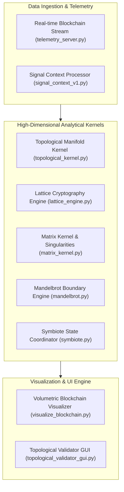

# 🌌 Galaxy Bitcoin System: Ψ Cognitive Engine & Topological Manifolds

<div align="center">

[](LICENSE)
[](https://www.python.org/)
[](topological_kernel.py)
[](lattice_engine.py)
[](https://github.com/ManoAlee/Criptcoins/actions)

**A high-dimensional computational trading and cryptographic manifold engine uniting Differential Geometry, Lattice Cryptography, Mandelbrot Fractal Sets, and Real-Time Blockchain Telemetry.**

[Key Innovations](#-key-innovations) •
[Architecture](#-system-architecture) •
[Mathematical Formulations](#-mathematical-formulations) •
[Computational Kernels](#-computational-kernels) •
[Quickstart](#-execution--demo) •
[License](#-license)

</div>

---

## ⚡ Key Innovations

### 1. Ψ Cognitive Token (Context-Bound Derivation)
Security is modeled as a resonance phenomenon rather than static state storage. The system derives ephemeral tokens through HMAC-SHA256 nonces dynamically bound to observer context:
> *"The token only exists for that observer, in that context. Any perturbance collapses the knowledge state."*

### 2. Multi-Angle Bio-Symmetric Manifold Projection
The identity and market verification engine projects state across a 5-step Riemannian manifold:
- Frontal Projection
- Right & Left Helical Torque
- Upper & Lower Angular Tilt

---

## 🏛️ System Architecture



---

## 🔬 Mathematical Formulations

### 1. Topological Manifold Curvature

The market state is evaluated as a continuous metric tensor $g_{\mu
u}$ over a 4-dimensional Riemannian manifold:

$$R^
ho_{\sigma\mu
u} = \partial_\mu \Gamma^
ho_{
u\sigma} - \partial_
u \Gamma^
ho_{\mu\sigma} + \Gamma^
ho_{\mu\lambda}\Gamma^\lambda_{
u\sigma} - \Gamma^
ho_{
u\lambda}\Gamma^\lambda_{\mu\sigma}$$

where connection coefficients (Christoffel symbols) are derived from the metric:

$$\Gamma^\sigma_{\mu
u} = rac{1}{2} g^{\sigma
ho} \left( \partial_\mu g_{
u
ho} + \partial_
u g_{\mu
ho} - \partial_
ho g_{\mu
u} 
ight)$$

### 2. Lattice Point Closest Vector Problem (CVP)

Cryptographic verification operates on discrete lattices $\Lambda \subset \mathbb{R}^n$:

$$\Lambda = \left\{ \sum_{i=1}^k a_i \mathbf{b}_i \;\middle|\; a_i \in \mathbb{Z} 
ight\}$$

---

## 📁 Computational Kernels

- `topological_kernel.py`: High-dimensional differential topology calculations and curvature evaluation.
- `lattice_engine.py`: Post-quantum lattice cryptographic verification algorithms.
- `matrix_kernel.py`: Linear algebra solver for market tensor eigenvectors and eigenvalues.
- `mandelbrot.py`: Fractal boundary analysis identifying self-similar market resonance patterns.
- `visualize_blockchain.py`: Real-time OpenGL and Matplotlib 3D blockchain visualizer.

---

## 🚀 Execution & Demo

```bash
# Clone the repository
git clone https://github.com/ManoAlee/Criptcoins.git
cd Criptcoins

# Run validation suite
python VALIDATE_ALL.py

# Launch interactive topological validator
python topological_validator_gui.py
```

---

## 📄 License

This project is licensed under the **MIT License** - see [LICENSE](LICENSE) for details.
